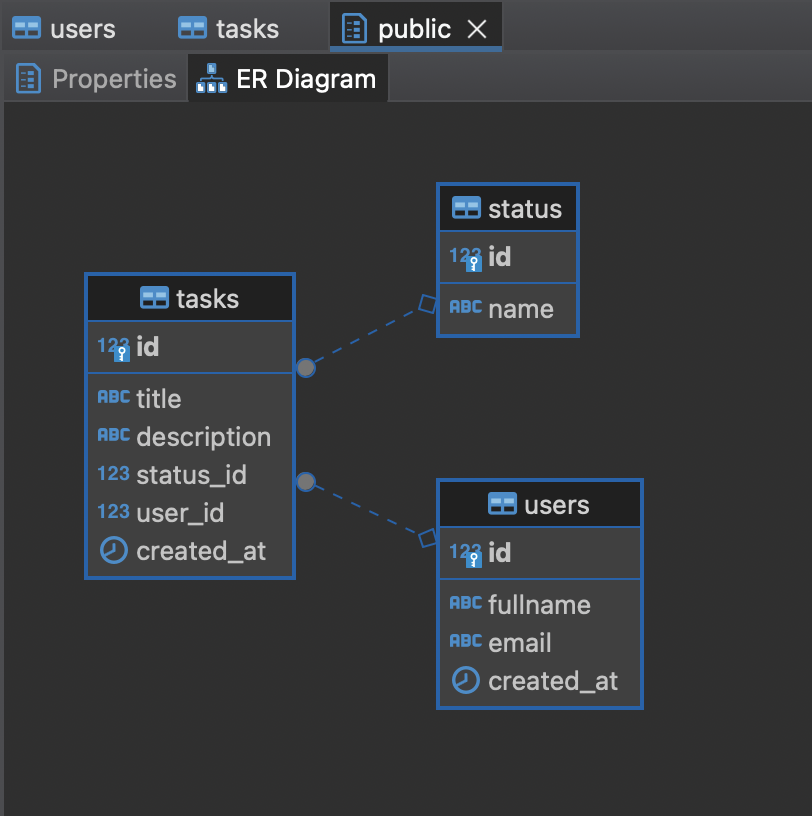

# goit-cs-hw-03


### Task 1

1. Start container with postgres
   
```bash
make up
```

2. Run python script

```bash
python seed.py
```

**Result**   
> Diagram  




> Users data  


> Tasks data  

